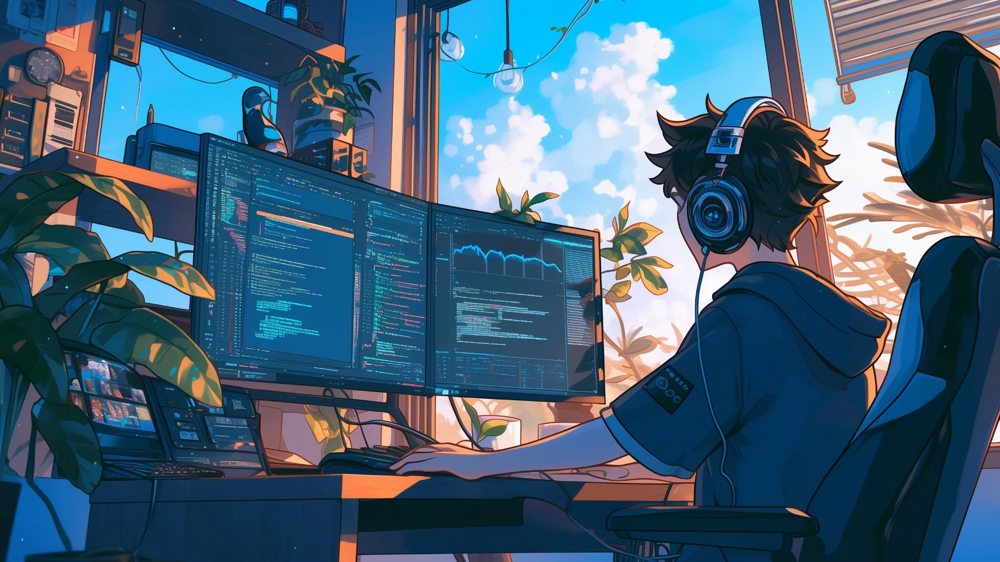

<!-- ═══════════════════════════════════════════════════════════════════════ -->
<!--                    UMAIR HABIB · Associate Software Engineer            -->
<!-- ═══════════════════════════════════════════════════════════════════════ -->

<!-- ░░░ HERO BANNER (custom lofi artwork) ░░░ -->
<!-- 👉 To switch banners: comment out the active <p> block and uncomment the other one. -->

<!-- ── OPTION 1: blue-sky / headphones / dual-monitor (ACTIVE) ── -->
<p align="center">
  
</p>

<!-- ── OPTION 2: cozy warm room / city window (commented out) ── -->
<!-- <p align="center">
  
</p> -->


<h1 align="center">Umair Habib</h1>
<p align="center"><b>Associate Software Engineer</b> · Full-Stack Web &amp; Mobile Developer</p>

<!-- ░░░ TYPING ░░░ -->
<p align="center">
  <a href="https://umairhabib.vercel.app/">
    
  </a>
</p>

<!-- ░░░ STATUS BADGES ░░░ -->
<p align="center">
  
  
  
</p>

<p align="center">
  
</p>

<!-- ═══════════════════════════════════════════════════════════════════════ -->

## 👨‍💻 About Me

```typescript
const umair = {
  role:      "Associate Software Engineer @ galvanai",
  based:     "Rawalpindi / Islamabad, Pakistan 🇵🇰",
  education: "B.S. Software Engineering — NUML (2021–2025)",
  focus:     ["Full-Stack Web", "Mobile", "AI-powered SaaS"],
  frontend:  ["Next.js", "React", "Angular", "TypeScript", "Tailwind"],
  mobile:    ["Flutter", "Android"],
  backend:   ["Python", "Flask", "Node.js", "REST APIs"],
  data:      ["PostgreSQL", "Firebase", "SQL/SQLite", "AWS"],
  values:    ["Scalable architecture", "Clean code", "Products that matter"],
};
```

> Associate Software Engineer with **1.5+ years** of professional experience delivering full-stack
> web and mobile applications — with a track record of shipping SaaS platforms, ERP systems,
> and large-scale education portals.

<!-- ═══════════════════════════════════════════════════════════════════════ -->

## 🛠️ Tech Stack

**Frontend**

<p>
  
</p>

**Mobile · Backend · Data &amp; Cloud**

<p>
  
  <br/>
  
</p>

<!-- ═══════════════════════════════════════════════════════════════════════ -->

## 💼 Experience

| Role | Company | Period |
|------|---------|--------|
| **Associate Software Engineer** | galvanai · *AI SaaS platforms* | 11/2025 – Present |
| **Frontend Developer Intern** | AIMS Soft · *Angular school ERP & Pakistan Education Portal* | 01/2025 – 05/2025 |
| **Flutter Developer Intern** | Eziline Software House | 07/2024 – 09/2024 |

<!-- ═══════════════════════════════════════════════════════════════════════ -->

## 🚀 Featured Projects

<table>
  <tr>
    <td width="50%" valign="top">
      <h3>🎓 Pakistan Education Portal</h3>
      <p><sub><code>Angular</code></sub></p>
      <p>Commercial university listing portal — engineered the <b>Apply</b> feature enabling students to submit admissions directly on-platform.</p>
    </td>
    <td width="50%" valign="top">
      <h3>🤝 Collaborative Edge</h3>
      <p><sub><code>MERN Stack</code></sub></p>
      <p>Real-time collaboration platform with live document editing, role-based dashboards, and skills showcasing for students, educators &amp; industry.</p>
    </td>
  </tr>
  <tr>
    <td width="50%" valign="top">
      <h3>💬 Real-Time Chat App</h3>
      <p><sub><code>Flutter</code> · <code>Firebase</code></sub></p>
      <p>Production cross-platform chat app with end-to-end message sync, secure auth, and real-time messaging.</p>
    </td>
    <td width="50%" valign="top">
      <h3>🛒 E-commerce Website</h3>
      <p><sub><code>React</code> · <code>Firebase</code></sub></p>
      <p>Responsive storefront with product listings, cart management, and Firebase-backed authentication.</p>
    </td>
  </tr>
</table>

<p align="center"><sub>✦ More projects &amp; live demos on my <a href="https://umairhabib.vercel.app/">portfolio</a> ✦</sub></p>

<!-- ═══════════════════════════════════════════════════════════════════════ -->

## 📊 GitHub Stats

<p align="center">
  
  
</p>

<p align="center">
  
</p>

<p align="center">
  
</p>

<!-- ═══════════════════════════════════════════════════════════════════════ -->

## 📈 Contribution Activity

<p align="center">
  
</p>

<p align="center">
  
</p>

<!-- ═══════════════════════════════════════════════════════════════════════ -->

## 📫 Connect With Me

<p align="center">
  <a href="https://umairhabib.vercel.app/">
    
  </a>
  <a href="https://www.linkedin.com/in/umair-habib-developer/">
    
  </a>
  <a href="https://github.com/Umair-Habibx123">
    
  </a>
  <a href="mailto:umairhabibabc@gmail.com">
    
  </a>
</p>

<!-- ░░░ FOOTER ░░░ -->
<p align="center">
  
</p>
